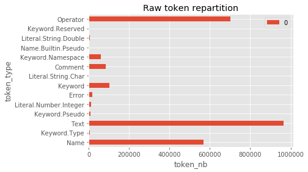
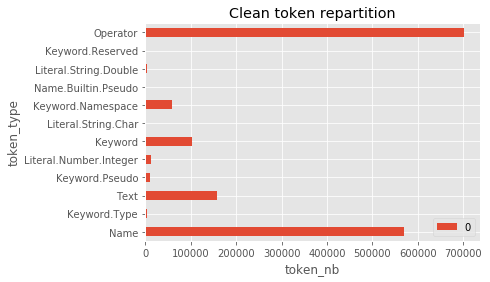
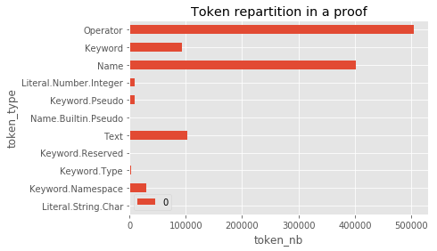

# Data
## Sources
### Homotopy Type Theory
- [HoTT source code](https://github.com/HoTT/HoTT)
- [Free online HoTT book](https://hott.github.io/book/nightly/hott-online-1075-g3c53219.pdf)

### UniMath repository
- [UniMath source code](https://github.com/UniMath/UniMath)

## Preprocessing


* `make preprocess`

| File | Usage |
|------|-------|
| data/download.sh                  | Download data from the Git repositories |
| srcs/preprocess/preprocess.py     | Create intermediate files containing the [tokens stream](#token_stream) |
| srcs/preprocess/aggregate.py      | Aggreate all intermediate files in a single csv dataset `data/agg.csv` |
| srcs/preprocess/clean_dataset.py  | Clean the aggregated dataset |
| srcs/preprocess/dependencies.py   | Generate dependency graph for the dataset `data/dependencies.gexf` |

### Example


| type         | Raw |
|--------------|-----|
| Raw input    |  [Here](#raw_input)   |
| Token stream |  [Here](#token_stream)   |
| CSV dataset  |  [Here](#csv_agg)   |

#### <a name="raw_input"></a>Raw input
```
Definition equiv_ind_comp `{IsEquiv A B f} (P : B -> Type)
  (df : forall x:A, P (f x)) (x : A)
  : equiv_ind f P df (f x) = df x.
Proof.
  unfold equiv_ind.
  rewrite eisadj.
  rewrite <- transport_compose.
  exact (apD df (eissect f x)).
Defined.
```

#### <a name="token_stream"></a>Token stream

```
Keyword.Namespace 'Proof'
Operator '.'
Keyword 'unfold'
Name 'equiv_ind'
Operator '.'
Keyword 'rewrite'
Name 'eisadj'
Operator '.'
Keyword 'rewrite'
Operator '<-'
Name 'transport_compose'
Operator '.'
Keyword.Pseudo 'exact'
Operator '('
Name 'apD'
Name 'df'
Operator '('
Name 'eissect'
Name 'f'
Name 'x'
Operator ')'
Operator ')'
Operator '.'
Keyword.Namespace 'Defined'
```

#### <a name="csv_agg"></a> Aggregated CSV dataset

|       | file_id | token_id | file                           | token             | raw           | proof_context | proof_id |
|-------|---------|----------|--------------------------------|-------------------|---------------|---------------|----------|
| 0     | 0     | 0      | /HoTT/theories/ExcludedMiddle  | Keyword.Namespace | Require       |               |          |
| 1     | 0     | 1      | /HoTT/theories/ExcludedMiddle  | Text              |               |               |          |
| 2     | 0     | 2      | /HoTT/theories/ExcludedMiddle  | Keyword.Namespace | Import        |               |          |
| 3     | 0     | 3      | /HoTT/theories/ExcludedMiddle  | Text              |               |               |          |
| ...   | ...     | ...      | ...                            | ...               | ...           | ...           | ...      |
| 15554 | 590   | 15554  | /UniMath/UniMath/PAdics/lemmas | Comment           | (*            |               |          |
| 15555 | 590   | 15555  | /UniMath/UniMath/PAdics/lemmas | Comment           | *             |               |          |
| 15556 | 590   | 15556  | /UniMath/UniMath/PAdics/lemmas | Comment           |  END OF FILE  |               |          |
| 15557 | 590   | 15557  | /UniMath/UniMath/PAdics/lemmas | Comment           | *)            |               |          |
| 15558 | 590   | 15558  | /UniMath/UniMath/PAdics/lemmas | Text              | \n            |               |          |

#### <a name="csv_clean"></a> Cleaned CSV dataset

|       | file_id | token_id | file                           | token             | raw     | proof_context | proof_id                             |
|-------|---------|----------|--------------------------------|-------------------|---------|---------------|--------------------------------------|
| 0     | 0     | 0        | /HoTT/theories/ExcludedMiddle  | Keyword.Namespace | Require |               |                                      |
| 2     | 0     | 1        | /HoTT/theories/ExcludedMiddle  | Keyword.Namespace | Import  |               |                                      |
| 4     | 0     | 2        | /HoTT/theories/ExcludedMiddle  | Name              | HoTT    |               |                                      |
| 5     | 0     | 3        | /HoTT/theories/ExcludedMiddle  | Operator          | .       |               |                                      |
|       |         |          |                                |                   |         |               |                                      |
| ...   | ...     | ...      | ...                            | ...               | ...     | ...           | ...                                  |
| 15550 | 590   | 8936     | /UniMath/UniMath/PAdics/lemmas | Text              | \n      |               | 0ccaca46-cbd3-4641-b18e-fd448ffbf0fe |
| 15551 | 590   | 8937     | /UniMath/UniMath/PAdics/lemmas | Keyword.Namespace | Defined | leave         | 0ccaca46-cbd3-4641-b18e-fd448ffbf0fe |
| 15552 | 590   | 8938     | /UniMath/UniMath/PAdics/lemmas | Operator          | .       |               |                                      |
| 15553 | 590   | 8939     | /UniMath/UniMath/PAdics/lemmas | Text              | \n\n    |               |                                      |
| 15558 | 590   | 8940     | /UniMath/UniMath/PAdics/lemmas | Text              | \n      |               |                                      |


## Analysis


### Token types

Repartition of the tokens on the raw dataset (`data/agg.csv`) containing the whole token streams.



Data cleaning operations :

* Remove empty texts tokens as they are irrelevent to learn
* Removed comments tokens
* Removed file with lexing errors



Tokens located directly in proofs, including definitions.




### Proofs
